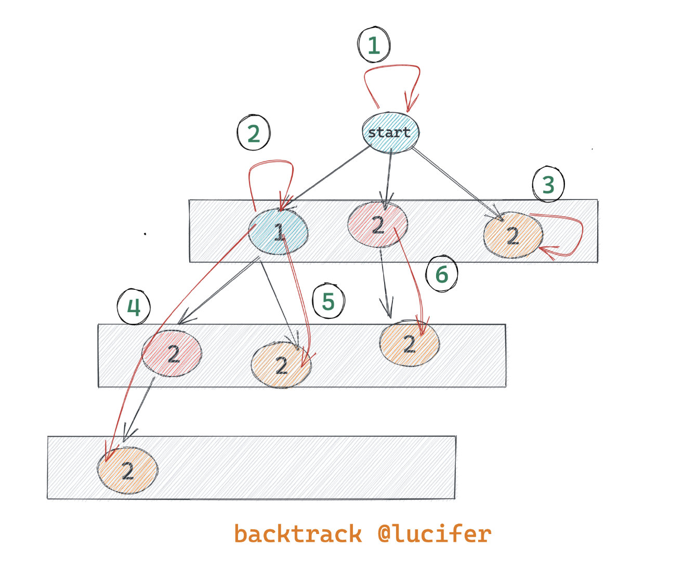

# 39. 组合总和

## 描述

```
给定一个无重复元素的数组 candidates 和一个目标数 target ，找出 candidates 中所有可以使数字和为 target 的组合。

candidates 中的数字可以无限制重复被选取。

说明：

所有数字（包括 target）都是正整数。
解集不能包含重复的组合。 
示例 1：

输入：candidates = [2,3,6,7], target = 7,
所求解集为：
[
  [7],
  [2,2,3]
]
示例 2：

输入：candidates = [2,3,5], target = 8,
所求解集为：
[
  [2,2,2,2],
  [2,3,3],
  [3,5]
]
 

提示：

1 <= candidates.length <= 30
1 <= candidates[i] <= 200
candidate 中的每个元素都是独一无二的。
1 <= target <= 500

```

## 思路

回溯通用解法

## 注意事项

去除重复的结果,不找回头的， start为i

## 技巧

回溯法通用解法 backtrace模板

https://leetcode.com/problems/combination-sum/discuss/16502/A-general-approach-to-backtracking-questions-in-Java-(Subsets-Permutations-Combination-Sum-Palindrome-Partitioning



## 代码

java

```java
import java.util.*;

class Solution {
    List<List<Integer>> ans = new ArrayList<>();
    public List<List<Integer>> combinationSum(int[] candidates, int target) 
    {
        List<Integer> tempList = new ArrayList<>();
        backtrace(tempList, candidates, target, 0);
        return ans;
    }

    private void backtrace(List<Integer> tempList, int[] candidates, int remain, int start)
    {
        if(remain < 0)return;
        else if(remain == 0)ans.add(new ArrayList<>(tempList));
        else
        {
            for(int i = start; i < candidates.length; i++)
            {
                tempList.add(candidates[i]);
                backtrace(tempList, candidates, remain - candidates[i], i);
                tempList.remove(tempList.size() - 1);
            }
        }
    }
}
```