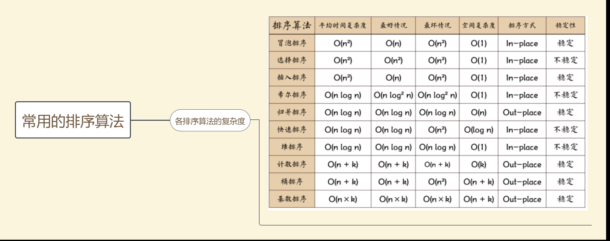

## 排序

### 常用的排序算法



### 快速排序

#### 思路

挖洞排序，随机选一个基准数，小于基准在左边，大于基准在右边，递归下去
取第一个数为基准，然后左右向中间靠，小于基准在左边，大于基准在右边，最后指针停止的数与第一个基准交换

注意：要从右边先开始靠（//todo 为什么？）

#### 衍生题目

1. 给一个巨大的数组，找出其中的中值

2. 找出第k大的数

## 链表

### 技巧
 
1. 多加一个指针
 
2. 快慢指针找中值
 
3. dummyNode简化操作，使得不需要对head做特殊处理

### 基本操作
 
1. 反转链表（递归&非递归）
 
   非递归 3个指针 (外面记录2个指针，循环额外记录一个)
 

### 注意事项

1. 分割链表记得断尾，否则会形成环
 
## 树

### 树的遍历
 
1. 先序遍历、后序遍历、中序遍历（递归&非递归）
 
   先序遍历
   
   非递归先访问自己，自己不断入栈，然后把指针移到左子树，直到null，再退栈把右子树入栈
 
   ```java
   class Solution {
       public List<Integer> preorderTraversal(TreeNode root) {
           List<Integer> list = new ArrayList<>();
           Stack<TreeNode> s = new Stack<>();
           TreeNode p = root;
           while(p != null || !s.empty()){
               while(p != null){
                   list.add(p.val);
                   s.push(p);
                   p = p.left;
               }
               if(!s.empty()){
                   TreeNode q = s.pop();
                   p = q.right;
               }
           }
           return list;
       }
   }
 
   ```
 
   中序遍历
 
    ```java
    class Solution {
        public List<Integer> inorderTraversal(TreeNode root) {
            List<Integer> list = new ArrayList<>();
            Stack<TreeNode> s = new Stack<>();
            TreeNode p = root;
            while(p != null || !s.empty()){
                while(p != null){
                    s.push(p);
                    p = p.left;
                }
                if(!s.empty()){
                    TreeNode q = s.pop();
                    list.add(q.val);
                    p = q.right;
                }
            }
            return list;
        }
    }
    ```
 
   后续遍历
 
    ```java
    class Solution {
        class PostNode{
            TreeNode root;
            boolean isFirst;
        }
    
        public List<Integer> postorderTraversal(TreeNode root) {
            List<Integer> list = new ArrayList<>();
            Stack<PostNode> s = new Stack<>();
            TreeNode p = root;
            while(p != null || !s.empty()){
                while(p != null){
                    PostNode n = new PostNode();
                    n.root = p;
                    n.isFirst = true;
                    s.push(n);
                    p = p.left;
                }
                if(!s.empty()){
                    PostNode q = s.pop();
                    if(q.isFirst == true){
                        q.isFirst = false;
                        s.push(q);
                        p = q.root.right;
                    }else{
                        list.add(q.root.val);
                    }
                }
    
            }
            return list;
        }
    }
    ```
 
   总结：
 
   二叉树遍历，非递归思路Traversal(root.left)相当于左子树入栈，Traversal(root.rihgt)相当于将右子树重复前面的操作
 
   后序遍历因为在递归中会退栈回到当前函数两次，所以需要判断栈顶是否访问了两次或者该栈顶的左右子树是否都被访问过！
 
 ## 树的分类

1. 红黑树和AVL树（平衡二叉树）区别

2. B树和B+树
 
## 队列

### 优先队列
 
实现方式
 
1. Heap（Binary， Binomial，Fibonacci），fibonacci堆性能是最好的
 
2. Binary Search Tree
 
## 滑动窗口（//todo）
 
返回滑动窗口的最大值,如何维护队列
 
1. 大顶堆 O(nlogk)
 
2. dequeue，双端队列 O(n)
 
去除无用比较，左侧永远是最大值
 
双端队列（deque，全名double-ended queue）是一种具有队列和栈性质的抽象数据类型。双端队列中的元素可以从两端弹出，插入和删除操作限定在队列的两边进行。
 

## 动态规划

### 经典题目
 
1. 最大上升子序列
 
2. 最长公共子序列

3. 最长公共子串

4. 最大连续子序和

5. 背包问题


## 多线程

### 生产者消费者模型

优化

一个队列生产的时候是可以同时消费的，所以生产者一把锁，消费者一把锁，两把锁区别对待

## 字符串

字符串的题目一般都是用dfs或者递归来实现，dfs的时间复杂度为O(2^n)(n为字符串长度)


## 其他

把一个题吃透比做多个道题更有效率